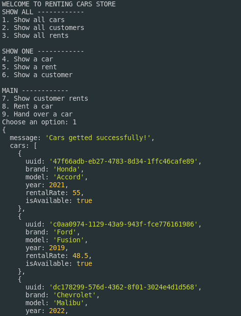

# Car Rent APP - Guide & Docs

This project works around the base functions needed in car renting. The main agents are: **Customer**, **Car** & **Rental**. With this repo, we can test all of the routes associated by command line.

## Install & Run

#### 1. Clone the repo

To get started, you need to clone this repository on your machine:

```https://github.com/noemyroberta/car_rent_app.git```

#### 2. Install Node JS

This project is made with Node JS. Please, install it [here](https://nodejs.org/dist/v21.6.1/node-v21.6.1-linux-x64.tar.xz).

#### 3. Install dependencies

You need to install the dependencies required to run the project.

```npm install```

You'll install all of the following deps:

```json
    "axios": "^1.6.7",
    "express": "^4.18.2"
```

#### 4. Run the project

`node app.js`

Then you're ready to go!

**WARNING:** Make sure you're on the project root.

## Use

### Get All Cars

;

### Get All Rents

;

### Get All Rents By Customer

;
